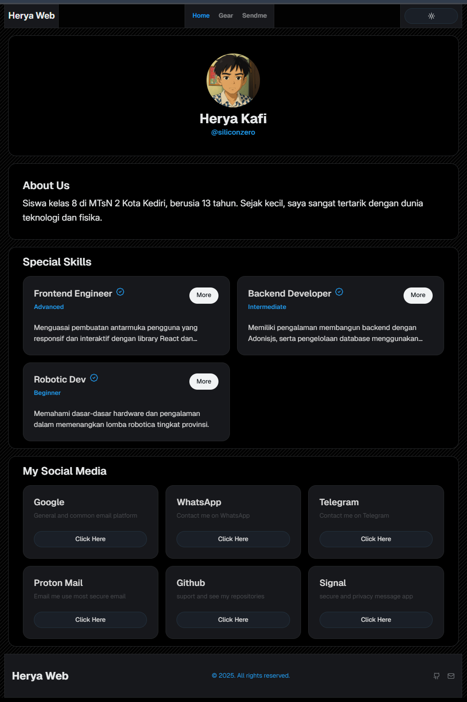
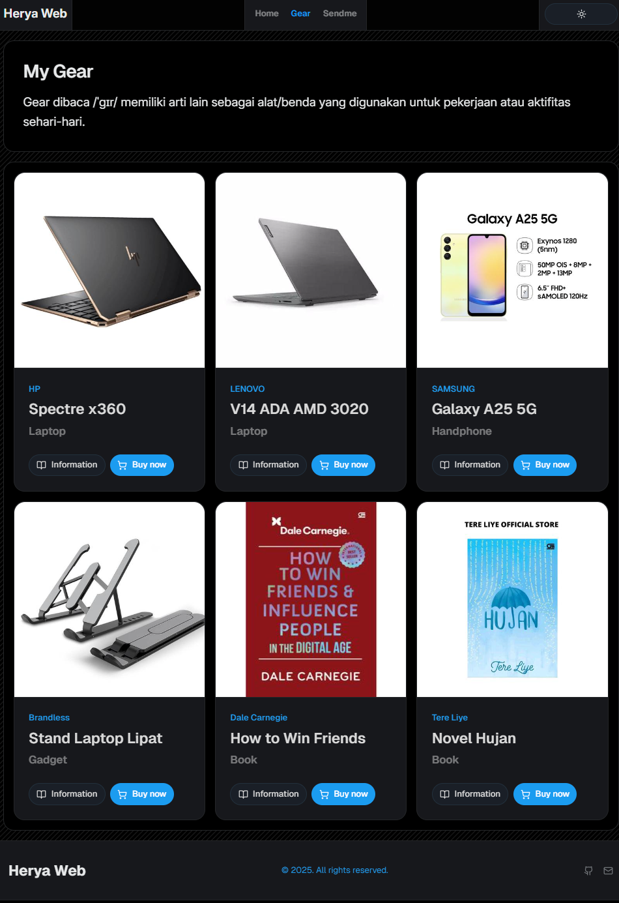
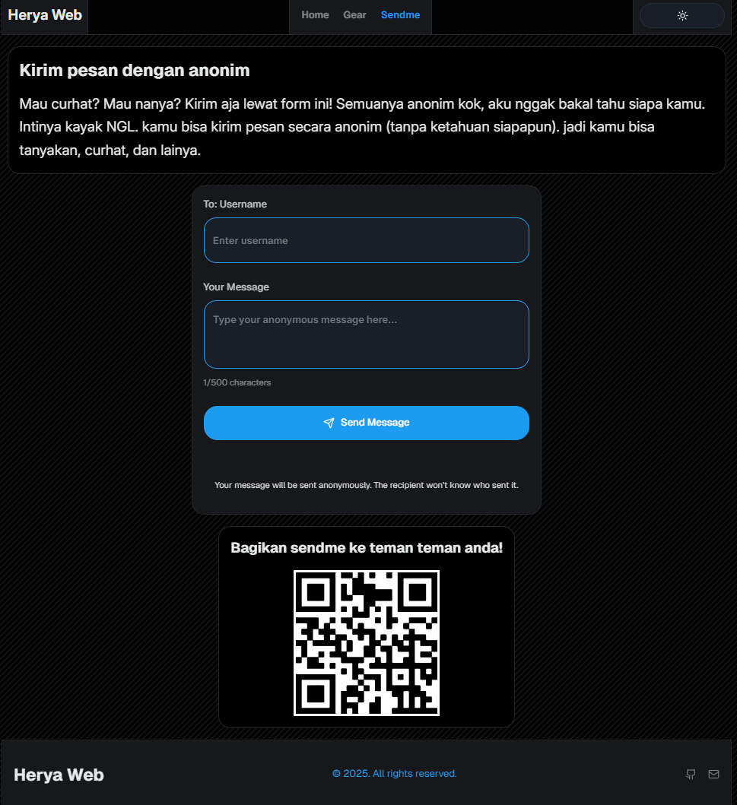

# Herya Official Blog
[](https://app.netlify.com/projects/herya/deploys)

`version: 0.0`
`status: dev`
`accessibility: private`
## Deskripsi

`Herya Official Website` merupakan sebuah official website yang di rancang sebagai herya web entry point.

## Teknologi Yang Digunakan

```
Client:
    "@hookform/resolvers": "^5.1.1",
    "@radix-ui/react-aspect-ratio": "^1.1.7",
    "@radix-ui/react-avatar": "^1.1.10",
    "@radix-ui/react-dialog": "^1.1.14",
    "@radix-ui/react-label": "^2.1.7",
    "@radix-ui/react-navigation-menu": "^1.2.13",
    "@radix-ui/react-slot": "^1.2.3",
    "@supabase/supabase-js": "^2.50.3",
    "@tailwindcss/vite": "^4.1.11",
    "class-variance-authority": "^0.7.1",
    "clsx": "^2.1.1",
    "lucide-react": "^0.525.0",
    "next-themes": "^0.4.6",
    "react": "^19.0.0",
    "react-dom": "^19.0.0",
    "react-hook-form": "^7.59.0",
    "react-qr-code": "^2.0.17",
    "react-router-dom": "^7.6.3",
    "sonner": "^2.0.6",
    "tailwind-merge": "^3.3.1",
    "tailwindcss": "^4.1.11",
    "zod": "^3.25.72"

Server:
    "@supabase/supabase-js": "^2.50.3",
```

## CLI Scripts

| Syntax           | Description |
| ---------------- | ----------- |
| `npn run dev`    | dev         |
| `npm run build`  | build       |
| `npm run start`  | live start  |
| `npm run lint`   | linter      |
| `npm run format` | prettier    |

## Commit Rules

**Format :** `<type>(<scope>): <subject>`

`<scope>` _opsional_

### Contoh:

```
feat(auth): Menambahkan fitur login
^--^        ^--------------------^
|           |
|           +-> Ringkasan dalam bentuk present tense.
|
+-------> Tipe: chore, docs, feat, fix, refactor, style, or test.
```

More Examples:
| Type | Deskripsi |
|-----------|-----------------------------------------------------------------------------------------------|
| `feat` | fitur baru untuk pengguna, bukan fitur baru untuk skrip build |
| `fix` | perbaikan bug untuk pengguna, bukan perbaikan pada skrip build |
| `docs` | penambahan dan perubahan dokumentasi |
| `style` | pemformatan, titik koma hilang, dll; tidak ada perubahan kode produksi |
| `refactor`| melakukan refaktor kode produksi, misalnya mengganti nama variabel |
| `test` | menambahkan tes yang hilang, melakukan refaktor tes; tidak ada perubahan kode produksi |
| `chore` | memperbarui tugas kasar dll; tidak ada perubahan kode produksi |
| `tools` | alat development, seperti lib, framework, dll |
| |

## Footage
### Home page
 
### Gear page
 
### Sendme page
 
[Apache-2.0 License](https://github.com/siliconzero/herya-official-blog/blob/main/LICENSE)
